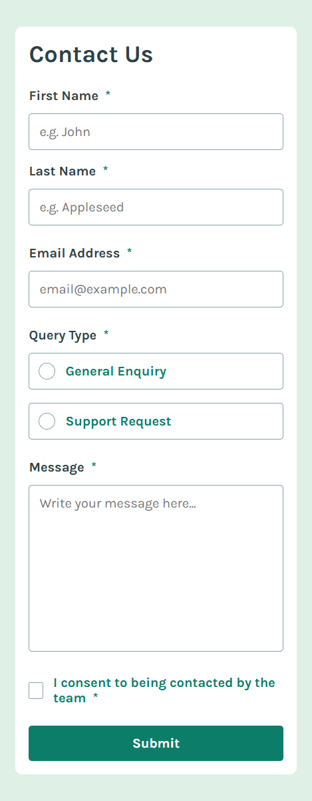

# Contact Us Form

This is a fully responsive "Contact Us" form project designed for desktop and mobile views. It includes validation for form fields, success notifications, and error handling to ensure a smooth user experience.

---

## Features

- **Responsive Design**:
  - Optimized for desktop and mobile devices.
  - Uses a modern and clean layout.

- **Form Validation**:
  - All fields are validated to ensure required inputs.
  - Specific validation for email format and other fields.

- **Dynamic Notifications**:
  - A success message appears at the top of the page when the form is successfully submitted.
  - Error states are highlighted for any invalid or missing input.

- **Focus and Active States**:
  - Inputs, radio buttons, and checkboxes have clear focus and active styles.

---

## Project Screenshots

### Desktop View


### Mobile View


### Success State


### Error State


### Focus and Active States


---

## Technologies Used

- **HTML**: For structuring the layout of the form.
- **CSS**: For styling and responsive design, including flexbox and media queries.
- **JavaScript**: For form validation, success messages, and dynamic behaviors.

---

## How to Run the Project

1. Clone this repository to your local machine:
   ```bash
   git clone https://github.com/AxM133

## Visit site

https://contact-form-main-five.vercel.app/